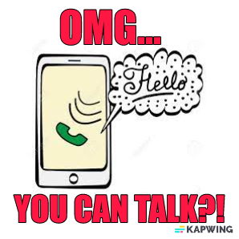
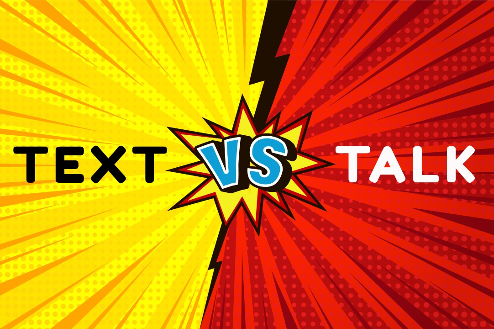
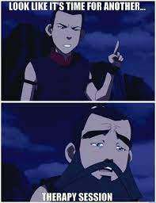
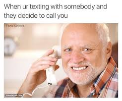
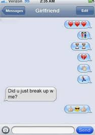
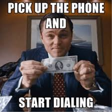
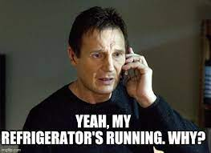

“To call… Or _not_ to call? That is the question.” (Shakespeare, 2023). In today’s digital age where the average person spends over three quarters of their waking lives on their phone, which is a fact I just made up, texting in some capacity has become the most common means of telecommunication. Despite this, there are still some instances where texting just doesn’t seem right, and a good, old fashioned phone call feels most fitting.

For anyone under the age of 20, Webster’s dictionary defines a “phone call” as, “an instance of speaking to someone on the phone or attempting to contact someone by phone.” For example, "he decided to make a **phone call** to a friend”. For anyone under the age of 25, Webster’s dictionary was a book of definitions used before you could look up the definition of any word on your phone. Now if anyone needs further clarity on what a “book” is, please feel free to PM me.

Now that we’re all caught up to speed, we here at SIPSTACK wish to assist you in deciphering these blurred lines of phone etiquette. It’s time to settle the text/call debate once and for all.

## When to Text

### Reminders

“Don’t forget to take out the garbage.”

“Remember to pick up some milk.”

“No, I still don’t want to go out with you, please stop texting me. How did you get my number? Do I even know you?”

We’re all busy, or at the very least, pretending we are. Sometimes we need to speak to someone for one purpose and one purpose only. Let’s not make a meal out of a basic reminder by forcing a phone call when the interaction could take a fraction of the time with a simple text.

### Jokes

Noticing something in the outside world that reminds you of an inside joke with a friend, family member, or partner is one of life’s simple pleasures. Referencing this comical moment to your loved one is a perfect opportunity to check in... via text. Whether it’s a quote, meme, photo, or even a simple emoji, sometimes less is more. A short and sweet visual reference will likely hit your loved one harder in the funny bone than a phone call explaining it would.

### Quiet Places

Coffee shops. Libraries. Busses. These are all generally considered to be quiet places. Let’s keep it that way, shall we? Granted, sometimes a call comes in at an awkward time and place, and we all just do our best to make the most of it. But if you're the one starting the interaction, try to read the literal room and recognize that a text is likely a more considerate, compassion, and downright altruistic choice than a call.

Small tangent: I frankly can't relate to people who can just talk it up like they own the place while everyone else in the room is essentially forced to eavesdrop on their one-sided phone convo. Where is all this confidence coming from? Have you no insecurities?! Look, confidence is a good quality, but there’s a limit. Can’t trust anyone that’s _too_ confident, am I right, folks? Okay, I feel like this is starting to say more about me than you… Let’s move on.

### When You're Already Texting

There is an art to a good text conversation, and this art does not include startling your texting partner with a sudden phone call. If you’re already conversing via text message, there is an implied social contract that that's just what this interaction is. A phone call at that point will be seen as jarring, unwelcome, and downright inappropriate. Don’t be this guy...

Which brings us to...

## When to Call

### Emotional Conversations

Resolving a fight. Supporting a friend. Breaking up with someone… These are all examples of interactions better served by a phone call than a text. A lot of nuance can be lost over texts, so when dealing with real emotions, it’s best to be as clear and personal as possible. This pursuit is most effective through your voice than through your font. Hell, maybe even go the extra mile and meet up in person for a chat like this? Or, ya know what? Never mind, that’s probz overkill. Just ignore me and breakup with your high school sweetheart with a series of emojis, yeah?

### Catch-Ups

Similar to the aforementioned emotional conversations, texts just don’t pack the same punch as phone calls do when genuinely attempting to catch up and connect with a loved one. Whether they’re overseas or life is just too busy to meet up in person, do yourselves a favour and don’t rely strictly on little text check-ins to nurture that entire relationship. Better to…

### Clarity and Clarification

Sometimes you make a sarcastic joke over text that doesn’t quite land. Sometimes you need to give detailed instructions, and you don’t feel like writing out the next great American novel on your phone. Sometimes you’re relaying an address to someone, and autocorrect simply refuses to let you have this one. Contrary to the wisdom preached in a different section of this very article, sometimes _more_ is more! When clarity is essential, always opt for a call.

### Prank Calls

These are just objectively better than prank… what, _texts_?! If it ain’t broke, don’t fix it!

Unless, of course, your friends use [Whois by SIPSTACK](https://whois.sipstack.com/) (a free reverse phone lookup tool), in which case, no prank calls are getting through!
