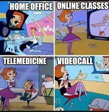

With the global pandemic giving rise to video communication platforms like Zoom, Microsoft Teams, and Google Meet, we are statistically living through “the most popular era for video chats since season three of The Jetsons.” (Me, 2023). 

With video chats being all the rage at work, catching up with friends overseas, and with your parents who still haven’t figured out how to turn their camera the right way, it’s becoming a bit ambiguous as to when a good, old fashioned phone call makes the most sense. We’re here to help you figure this out once and for all!

First off, we have…

## WHEN TO MAKE A VOICE CALL

## Multitasking

From cleaning your room to cooking dinner, everyone knows you can get a lot done during a classic speaker phone call. Since people like to think you’re giving them your full and utmost attention, video calls can really impede our ability to multitask. They also pretty much rule out pacing around aimlessly during a call. Or am I the only one who does that? 

## Casual Work Calls 
As much as video calls have dominated the work space the last few years, sometimes initiating a simple voice call with a colleague is the most considerate etiquette. Just imagine... No need to fix your hair. No need to move from your couch to your desk. No need to put on a shirt, (since we _all_ know nobody’s wearing pants…)

## Shoddy Reception

So you’re traveling in South East Asia, and you haven’t spoken to your friend or family members in months. You somehow find a time that works for both of your respective timezones, and your first catch-up video call is finally underway. Unfortunately, you might as well be speaking in the native language of the country you’re in because this video chat is freezing more than the iceberg that sunk the titanic. (Too soon?!) 

Regardless, sometimes switching to a voice call can really help with reception issues. Besides, your loved ones have plenty of time to see your face when they pretend to look at your Instagram posts.

Okay, three’s enough, right? (We all know nobody’s actually learning anything from this article.) Let’s now shift gears into…

## WHEN TO MAKE A VIDEO CALL

## Professional Work Calls
Although some people say, “sometimes initiating a simple voice call with a colleague is the most considerate etiquette,” (Me again, earlier this article), there are some work calls that are better suited to the futuristic wonders of the video call. Job interviews, professional presentations, and pitch meetings are all good examples. (Just make sure you’re better at sharing your screen than I am…) If “a picture is worth a thousand words,” (Not me, 1941 give or take), a video’s gotta be, what, at least a thousand and one, right?!

## Virtual Tours
Whether you’re looking for someone to sublet your apartment or showing off your new home to your parents whom you’d rather not invite over to show them in person, sometimes visual aid is flat out necessary. So unless you can describe your bathroom with the vivid imagery of Stephen King, best to opt for a video call on this one. “The sparkling toilet water flowed as gently as the Nile River at sunset, smelling only slightly more of urine.” 

## Showing Off New Pet
Dogs. Cats. Hell, I’ll even add your newborn baby to this list! What do these all have in common? They’re generally quite pleasing to look at. For the full effect, always make sure to show off your adorable new family members via video call over voice call… Unless, of course, they have a truly epic bark, meow, or traumatized cry!

You’re so very welcome! We hope you enjoyed this highly educational and invaluable article. And remember, whether you’re receiving a voice call or video call, [WHOIS by Sipstack](https://www.sipstack.com/product/whois) can help protect you against spam. Just make sure you verify your number, so your score is high enough for your friends to answer your calls! 
