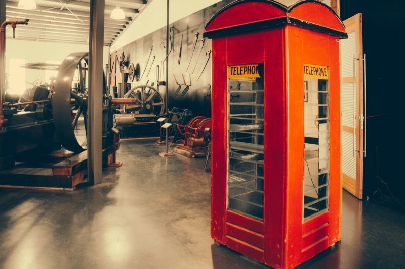

  
Photo by [Paul Carmona](https://unsplash.com/@sydneylens?utm_source=unsplash&utm_medium=referral&utm_content=creditCopyText) on [Unsplash](https://unsplash.com/photos/tqdyMlJk7Wk?utm_source=unsplash&utm_medium=referral&utm_content=creditCopyText)

When you make a telephone call on a landline phone, you lift a receiver or press a button and listen for a dial tone. This opens up a circuit between your home phone and the telephone exchange. When you dial the phone number, a second circuit is opened between the telephone exchange and the person you’re calling. For as long as you’re on the phone, the circuit remains open, and data (in the form of your voice) is sent and received over that open line. This [analog](http://sipstack.com/resources/blog/analog-technology) technology is called **circuit switching**.

Landline telephones are connected to the **Public Switched Telephone Network** (PSTN), a network of physical copper and fibre-optic cables that carry electric signals across vast distances.