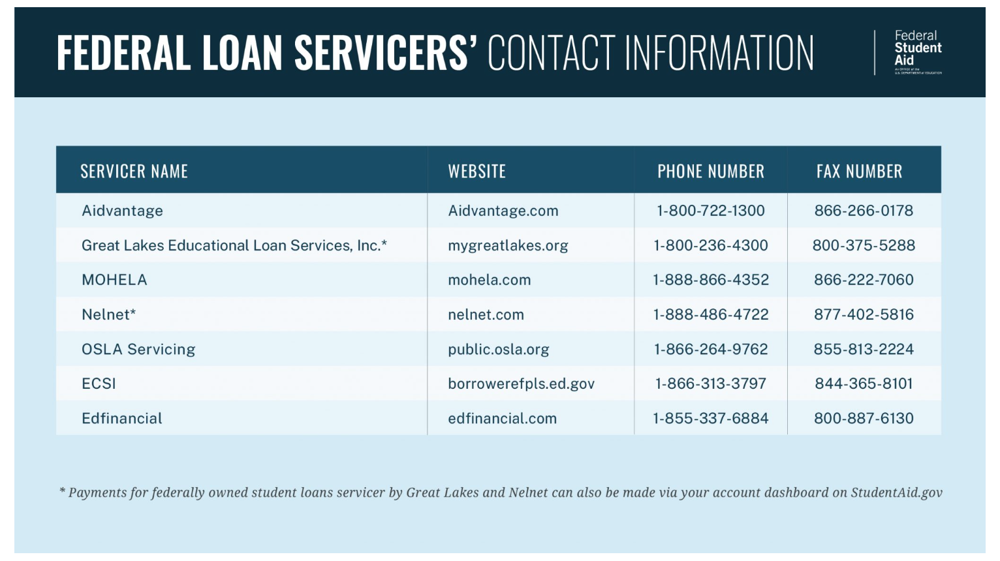

For people still paying off student loan debts, any opportunity to alleviate them is always something that will catch their attention. Unfortunately, scammers are all too aware of this and take advantage of people in this very situation. They do so via emails, phone calls, and text messages that promote programs they claim will guarantee immediate cancellation of their victims’ debt in exchange for an upfront fee. Of course, once that fee has been paid, victims will learn that the scammers were full of it from the get-go and have no intention of providing the services they promised.

## Examples of Student Loan Forgiveness Scams

Here are some quotes taken from actual scams:

“Act immediately to qualify for student loan forgiveness before the program is discontinued.”

“Your student loans may qualify for complete discharge. Enrolments are first come, first served.”

“Student alerts: Your student loan is flagged for forgiveness pending verification. Call now!”

It is true that sometimes the U.S. Department of Education (ED) may reach out to promote temporary programs. However, they will never contain aggressive advertising language like the quotes highlighted above.

## Other Red Flags To Watch Out For

In addition to an up front fee, scammers may also request monthly fees. In some cases, they may even ask for your Federal Student Aid (FSA) ID (account username and password), which is something that ED and its partners will never do. 

Getting your loans forgiven in a legal and legitimate manner is a long process. In fact, most government forgiveness programs require years of qualifying payments and/or employment in certain fields before forgiving loans. Anyone offering anything less than that should be approached with care and caution.

Lastly, always keep an eye out for any unusual capitalization, improper grammar, or incomplete sentences in emails or texts that claim to offer student loan forgiveness. Errors like these are another good indication a potential scam. 

Which brings us to why you should always…

## Confirm You’re Working With a U.S. Department of Education Partner
ED works closely with several private companies, including both lenders and servicers, to support federal student loans and borrowers alike. If you need assistance with your student loans or are pursuing some form of student loan forgiveness, make sure you’re communicating with a trusted and reliable ED-affiliated company.

Here is a list of contracted federal loan servicers, which you should always review before reaching out to a potential partner.

## What to Do if You See a Potential Student Loan Forgiveness Scam

- If you’ve been scammed or see any suspicious promotions regarding student loan forgiveness, <a href= 'https://studentaid.gov/feedback-center/' target="_blank"> submit a complaint </a> with FSA to file a report.
- If you think the scam involves your FSA ID, or if you’ve shared your FSA ID details with someone you suspect to be a scammer, be sure to <a href= 'https://studentaid.gov/fsa-id/sign-in/landing' target="_blank"> log in and change your account password </a> ASAP. 
- Review your account information (contact email, address, and phone number) to ensure it’s still accurate.
- Contact your federal loan servicer and bank or credit card company, as well as the Federal Trade Commission (FTC) and the Consumer Financial Protection Bureau (CFPB).

## Other Ways to Protect Yourself

1) If you receive a call or text from an unknown number about student loan forgiveness, use [Whois by SIPSTACK](https://whois.sipstack.com/) to see the number’s risk rating score. This will allow you to determine whether or not it is safe before you decide to respond.  
2) If you find out the number does belong to a scammer, rate and review it in the Whois portal, so members of your community can protect themselves as well.
3) Create an account and verify your number with Whois. This will put you on the “Do Not Call List” from verified spam numbers and other unwanted telemarketers. 

## How SIPSTACK Fights Fraud

Using the latest technology and machine learning, SIPSTACK's systems authenticate all activity in real time against variables that affect your security. When a carrier implements SIPSTACK's [Smart CNAM](https://www.sipstack.com/products/smart-cnam), they are able to customize a threshold for calls to pass through, based on their specific needs. Additionally, [Whois by Sipstack](https://whois.sipstack.com/) is the biggest and best AI-powered reverse lookup database that individuals can use to help eradicate spam. At SIPSTACK, we take an active role in ensuring we are building a secure and connected tomorrow. [Contact us](https://www.sipstack.com/contact/us) today to learn how you can protect yourself from spam.
