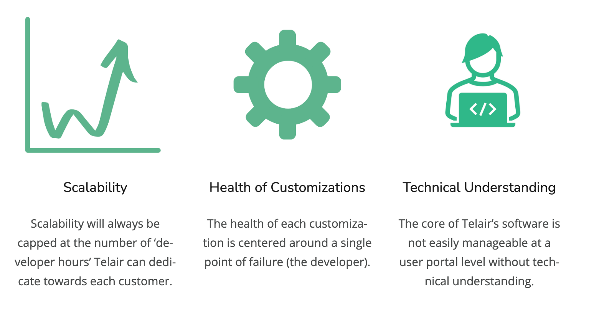
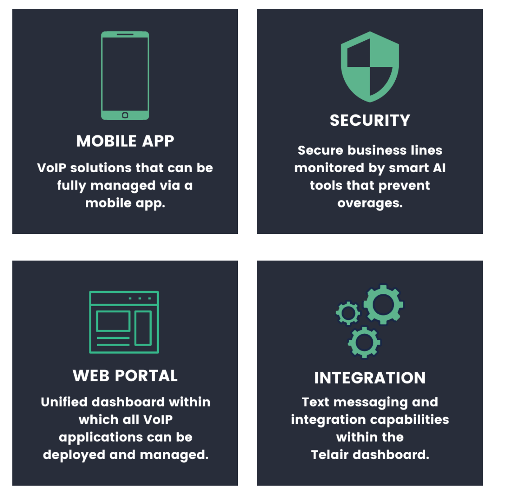
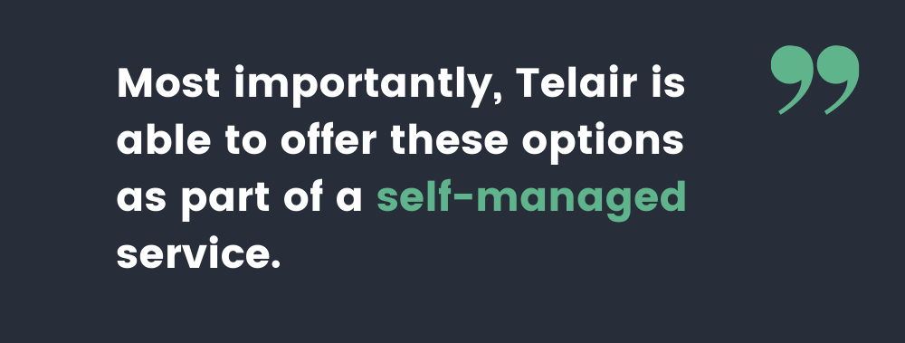

## About TELAIR

TELAIR was the first telecommunication company in Canada to utilize SIPSTACK UC, a new class 5 enterprise-grade platform. TELAIR managed PBX offering has empowered Canadian businesses with capabilities beyond phone system basics by enabling true customization in a shared cloud environment. TELAIR is also known for it's fanatical customer support. While they boast of a 2-hour response window, they typically respond to any service requests within ten minutes.

## Evolution of VoIP

Since the inception of TELAIR, the scope of VoIP has expanded exponentially. VoIP has found applications beyond the corporate sector and the enterprise phone universe. VoIP has invaded the marketing space. To effectively communicate with their customers, businesses want plug and play VoIP solutions that can be customized at the click of a button.

## The Answer

To stay competitive, TELAIR needs to be able to offer its customers

- VoIP solutions with text messaging capabilities
- Interactive AI-enabled VoIP solutions that reduce the strain on TELAIR’s customer service resources
- More autonomy within TELAIR’s web portals
- Advanced features setting TELAIR apart with competitive features and services

## The Problem

In a post-Covid world, demand for better communications tools are required for survival. Deploying any other solution short term would eventually require a large financial Investment to overhaul existing equipment while maintenance migrations windows could pose additional risk.

### Customization is Time Consuming

> ###### _Right now, we’re only able to scale to the extent that we can customize, and each customization has to be developed into the platform from the ground up. If a client asked us to provide text messaging integration along with our existing VoIP service, I’d have to leverage two different services to try and stitch together a final solution, which would still be fragmented._
>
> ###### _There is no one size fits all solution within our platform._
>
> _Michelle S, President, TELAIR_

TELAIR has always had a growth mindset, and they want to find an intelligent way to scale their business. They’ve recognized that building out unique customizations for each customer has several limitations:

## The Solution

SIPSTACK was developed for IT providers and savvy business owners. All elements of telephony (PBX, phone lines, fax, conferencing) can be deployed in less than 25 seconds. SIPSTACK also has unique security measures in place to move its voice traffic.

### SIP Protocol

SIPSTACK’s unique SIP protocol approach operates on ports invisible to port-sniffers and hackers. This technology allows SIPSTACK to effectively eliminate the siphoning of unauthorized call minutes and saves its VoIP users tens of thousands of dollars in overage charges.

### AI Tools

SIPSTACK uses smart AI tools to continuously monitor a company’s call destination pattern. When a call goes to an irregular destination that looks illegitimate, SIPSTACK’s AI shuts off the company’s long-distance calling and sends a notification to the customer’s NOC team with information about when the call was attempted and the IP address the call originated from.

But what really makes the overhaul of TELAIR’s legacy software and equipment worth it for TELAIR is that customization is also just a few clicks away!

## Use Cases

TELAIR has already been able to use SIPSTACK’s APIs to support two distinct use cases. The first one is a CRM integration for a real estate brokerage. The second one is an order management system for a pizza franchise. For both cases, TELAIR leveraged SIPSTACK’s ability to seamlessly integrate with third-party applications to provide each customer with the exact customizations they needed. The President of TELAIR, Michelle S describes each use case in detail.

### CRM Integration

_‘Our client’s paging system was quite antiquated. When a lead called in, the receptionist would have to manually type in the contact information and send it to the real estate agent. The client wanted to minimize the probability of losing a lead because of human error. By integrating their VoIP service with a third-party CRM, they would be able to track each lead through every stage of the sales funnel.’_

### Order Management

_‘The client wanted a VoIP solution that could help their delivery team coordinate web orders, customers get accurate wait times based on the number of staff working at each pizza location and the ability for staff at each pizza location torecommend pizzas based on a customer’s previous order.’_

## Driving Success with SIPSTACK

By implementing the SIPSTACK platform, TELAIR is able to serve and support its customers at a whole new level without adding costs that would eat away at their bottom line. Now, TELAIR’s customers can do more, understand more, and see more of their VoIP solution, all within one easy-to-use, visually appealing web portal.

### The Cost of Staying Competitive

> ###### _Although overhauling all of our legacy systems is going to incur a significant amount of upfront cost, we realize that there’s no other way to stay competitive while continuing to support customers in the way we want to, and they need to be! Our customers need to know that they can count on us to give them more than what Telus, Bell, or Rogers can at half the cost. with features they can’t live without._
>
> ###### _SIPSTACK’s software has received tremendous positive feedback._
>
> _Michelle S, President, TELAIR_

To learn more about SIPSTACK and TELAIR, please visit [sipstack.com](https://www.sipstack.com) or [telair.net](https://www.telair.net).

All customers who signed up with TELAIR before June 2021 will be transitioned to the SIPSTACK system for free.
