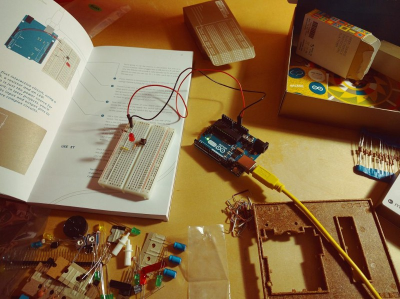

As a Technical Writer at a cloud communication company, I’m invested in understanding technologies fundamental to the telecommunications industry. Now that I have written about the [invention of the telephone](http://sipstack.com/resources/blog/history-of-the-phone) and [the history of VoIP](http://sipstack.com/resources/blog/the-history-of-voip), I set out to answer a few fundamental questions about VoIP, such as how VoIP technology is different from [telephone technology](http://sipstack.com/resources/blog/telephone-technology-explained), and whether VoIP works over the telephone network or the internet.

## What is VoIP?
**Voice Over Internet Protocol (VoIP)** is the capability to transmit voice signals in real time over the internet and telephone network.

## How does VoIP work?
Unlike the telephone, VoIP was not [invented](http://sipstack.com/resources/blog/the-history-of-voip) in one stroke. VoIP emerged as a result of decades of experimentation with different scientific ideas and technologies such as packet switching, Linear Predictive Coding, TCP/IP and the internet.

I will thread a needle through the stories behind these technologies to help explain how the technology behind VoIP works.

## Circuit Switching and Packet Switching

Photo by [Spencer](https://unsplash.com/@spen?utm_source=unsplash&utm_medium=referral&utm_content=creditCopyText) on [Unsplash](https://unsplash.com/s/photos/circuit?utm_source=unsplash&utm_medium=referral&utm_content=creditCopyText)

Remember, how, in the movie Up, the grandpa flies his entire air-balloon house to Paradise Falls? He used **circuit switching** (a form of [analog technology]((http://sipstack.com/resources/blog/analog-technology))) to move his house. Instead, if he had shipped parts of the house to Paradise Falls in chunks, along different routes, he would’ve used **packet switching** technology.

Packet switching works by breaking up data into tiny pieces or packets. To transfer voice over a data network, the human voice is packetized and each piece is marked with the destination it’s supposed to reach. Once every piece knows where it’s going, the route it chooses to reach its destination doesn’t matter — the point is, an open line is no longer needed to transfer data. The process of packetization compresses the caller’s voice signal, transfers it over the IP network, and decompresses it at the other end.

Packet switching is a much more efficient way of sending and receiving data because it brings down cost dramatically while being able to transfer more data.

## Linear Predictive Coding
In 1966, two Japanese researchers invented a way to convert speech into a digital signal so that it could be stored and played back on computers. This ability to synthesize and transmit speech is called the Linear Predictive Coding (LPC) method and is used in VoIP to this day.

## The Internet and the World Wide Web

Photo by [Kvistholt](https://unsplash.com/@freeche?utm_source=unsplash&utm_medium=referral&utm_content=creditCopyText) Photography on [Unsplash](https://unsplash.com/s/photos/server?utm_source=unsplash&utm_medium=referral&utm_content=creditCopyText)

In 1969, the US Department of Defence funded the creation of ARPANET (Advanced Research Projects Agency Network), a decentralized phone network that would not be disrupted by a global war. The ARPANET connected computers via modems at numerous locations across the United States, and used TCP/IP to switch packets of data between different locations over a telephone line. Eventually, more computers were added to this network, and the network was made publicly available.

This collection of standalone computers and computer networks, which has been linked together using copper and fibre-optic cables, is called the **internet**.

The World Wide Web was invented by a group of researchers led by Tim Berners-Lee at CERN, an international scientific organization in 1989. The **World Wide Web** is an information system that can be accessed on the internet.

## What is TCP/IP and how does it work?
TCP/IP refers to Transmission Control Protocol/Internet Protocol. It is a standard form used to transfer information across the internet. As the name suggests, the TCP/IP protocol consists of two parts: the Transmission Control Protocol and the Internet Protocol.

The **Transmission Control Protocol** sorts out how packets of data move back and forth between one computer and another. The TCP allows data to be broken into pieces, transmitted, and reassembled in the correct order at the other end.

The **Internet Protocol (IP)** is the Internet’s addressing system. Each machine on the internet is identified by a unique IP address which takes the form of a series of digits separated by dots or colons.

## The Evolution of VoIP

Photo by [NordWood Themes](https://unsplash.com/@nordwood?utm_source=unsplash&utm_medium=referral&utm_content=creditCopyText) Photography on [Unsplash](https://unsplash.com/s/photos/server?utm_source=unsplash&utm_medium=referral&utm_content=creditCopyText)

Each of these technologies — packet switching, LPC, internet and TCP/IP has shaped VoIP as we know it today. While LPC provided a way to record and transmit speech digitally, packet switching allowed data to be transmitted without an open line. TCP/IP provided a protocol for packets of data to travel across the internet to specific destinations.

Today’s VoIP solutions do much more than transmit voice — they support audio and video conferencing, faxing, voicemail functions, and text messaging. A good VoIP platform will also support a wide range of integrations with third-party applications. The best VoIP solutions are powerful and agile enough to power customizations at scale.

SIPSTACK is at the forefront of pushing the boundaries of VoIP. Stay ahead of your communication needs by [partnering with us](https://www.sipstack.com/partner).