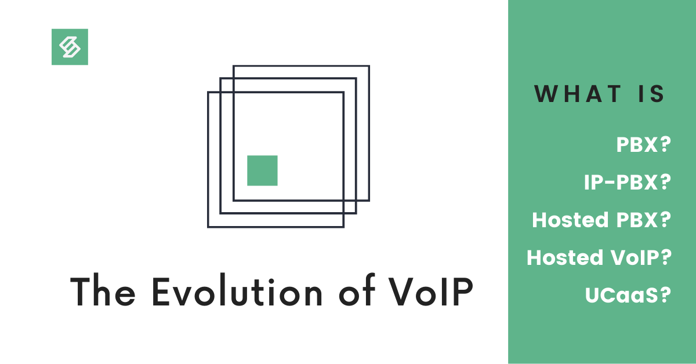

Over the last two decades, VoIP has transitioned from hardware reliant technology to a unified communication platform that can be hosted on the cloud. Now that we understand [the history of VoIP](http://sipstack.com/resources/blog/the-history-of-voip) and [how VoIP works](http://sipstack.com/resources/blog/voip-technology-explaned), we can dive into how this shift from hardware-dependence to software-first philosophy changed the landscape of VoIP.

## PBX
Have you ever called a business, and selected numbers from menu options, or dialed an office extension? Then, you’ve used a PBX.

PBX stands for Private Branch Exchange. Just as [the telephone exchange](http://sipstack.com/resources/blog/telephone-technology-explaned) connects landline phones on the [PSTN network](http://sipstack.com/resources/blog/telephone-technology-explaned), the private branch exchange connects all the stations (physical phones, fax machines, printers, credit card terminals, and modems) within a private organization to each other, and to the PSTN network. The biggest advantage of a PBX is that internal calls (between two stations) can be made without any cost to the business.

## History of the PBX
In the mid-1970s, a decade after PBX technology became available, automatic switches could be developed because of two main reasons:

1. Advancements in semiconductor technology.
2. Invention of the integrated circuit.

The switches transformed the PBX from behemoth mechanical machines into efficient, automated systems.

The automated systems were called PABX or Private Automatic Branch Exchange. Over time, these electromechanical PABX systems were replaced by electronic PBXs. The cost of producing automated switches came down, and eventually, automation became sophisticated enough to entirely eliminate the need for a human operator.

Automation also paved the way for feature development. By adding functionality and convenience, the following features were instrumental in increasing the popularity of the PBX:

- Automatic call routing of incoming calls
- Active call transfer capability between stations
- The flexibility to accept or deny calls
- Voice messaging
- Call queuing

The next iteration of the PBX was called the Time Division Multiplexing (TDM) system. The TDM PBX used computer technology to route and manage telephone calls and drove the shift from [analog to digital transmission](http://sipstack.com/resources/blog/voip-technology-explaned). While the ease of automation the TDM PBX provided was valuable, businesses also had to invest in new TDM-compatible phones and switchboards to avail of the technology.

## IP-PBX
A new era of telecommunications began when the internet was invented. VoIP technology evolved in tandem, and advancements in one field impacted the other.

Telecom hardware manufacturers started mass-producing phones that could directly route phone connections over the internet. Since these telephones used the internet protocol (IP) to route connections, they were called IP phones.

IP phones could facilitate the analog-digital conversion required to switch calls between the PSTN network and the internet without the need for any additional hardware.

Once IP phones entered the market, it was clear that the PBX, which connected the various IP phones, could also use an overhaul.

In 1999, Mark Spencer, the founder of a Linux tech support startup, determined that the traditional PBX was too expensive for his needs. He implemented the functions of the PBX into a software program, and the first IP-PBX. This open-sourced, Linux-based IP-PBX was called Asterisk after the symbol (*), one of the two hotkeys used to dial an extension.

IP-PBXs included several advanced features including the following:

- Call switching and routing
- Unified messaging
- Voicemail to email capability

The IP-PBX had a couple of key advantages over a TDM PBX:

1. **Hardware Agnostic:** Since the TDM PBX worked at the hardware layer, it heavily restricted a company’s ability to switch vendors after the system had been set up. The IP-PBX, however, was implemented at the software layer. This voided the need for expensive, proprietary solutions, and reduced a company’s reliance on a particular hardware supplier.
2. **Scalability:** The IP-PBX lent itself to scalability. While businesses would’ve had to add more switchboards to add more phone lines with a TDM PBX, adding phone numbers and extensions to an IP-PBX was a breeze. Businesses could simply add more phones to their network to expand.
The first IP-PBX systems were housed on site. Several factors, however, drove the shift towards virtual solutions:

1. As the network of printers, faxes, phones and modems became more complex, the task of maintaining a PBX required specialized skills.
2. In the late 2000s, with the emergence of cloud computing, business solutions could be moved to the cloud.
3. As computers took over more and more of the PBX’s functions, it eliminated the need for companies to invest in expensive hardware to own a fully functioning PBX.

Businesses found it easier to outsource the management of the entire PBX system and chose to use a Hosted PBX in place of a physical system.

## What is a Hosted PBX?
A Hosted PBX is a telephone switching system hosted in the cloud; it is often managed by a third-party service provider who charges a monthly fee for maintenance and real-time support. Access to a Hosted PBX is established over the internet.

A Hosted PBX includes all the features of a regular phone system as well as advanced call routing and distribution, voicemail, faxing, automated greeting and conference capabilities.

A Hosted PBX also make it easier for companies to scale as they grow- adding a new phone line or a user to the network is as easy as clicking a few buttons on the screen.

## What is Hosted VoIP and how is it different from Hosted PBX?
It is easy enough to distinguish between VoIP and PBX. Any technology that uses the internet protocol to transmit voice is categorized as VoIP. A PBX is a private telephone network used within an organization. However, as both these services move to the cloud, the distinction starts to blur.

A Hosted PBX is a type of Hosted VoIP solution. A hosted VoIP solution, however, provides a multitude of extensive features beyond PBX capabilities, such as:

- Mobile & desktop access to Hosted PBX
- CRM & other integrations
- Advanced call analytics
- Call Centre capabilities such as call queuing and
- Voicemail-to-email (voice-to-text transcription)
- Audio and video conference calling
- Data sharing
## Unified Communications as a Service
These layers of abstraction, however, help us build amazing, innovative solutions. Today, customers can use voice, text, email, video, messaging, chat, fax, voicemail, conferencing, data sharing, screensharing and other communication capabilities as part of one integrated solution.

While each of these capabilities had to be configured at the hardware and software level in the past, now, they can be hosted on the cloud and run on your device as a distinct application. And now that hosted VoIP (Hosted PBX with superpowers) has transformed into a completely virtual application-based solution, this technology deserves new coinage: Unified Communications as a Service (UCaaS).

SIPSTACK offers a dynamic UCaas solution that can be completely customized for each unique business case. Check out our fully stacked feature list, designed to evolve with your needs.

