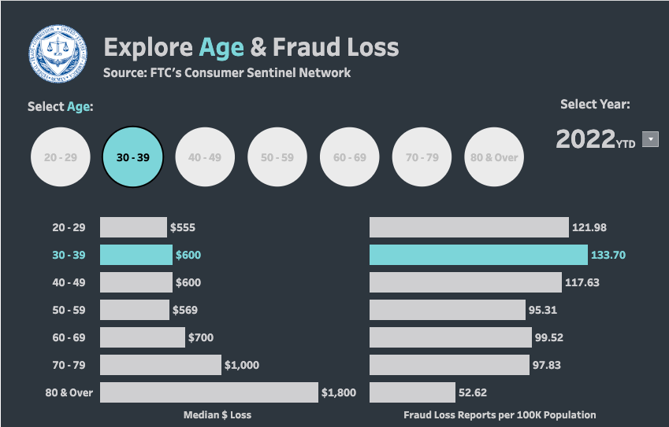
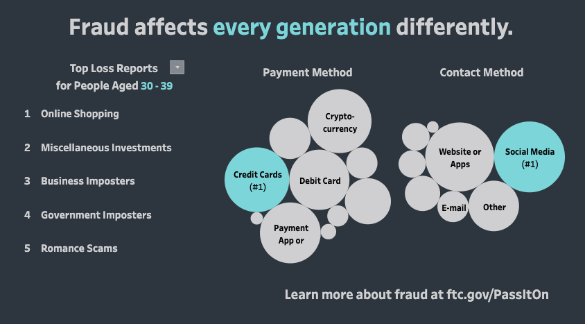

It is a common misconception that seniors are disproportionate victims and targets of fraud. This myth is dangerous, as younger people believe they are safe from scams. However, growing up with technology or being more tech-savvy doesn’t necessarily protect you from scam and fraud. People of all ages should exercise caution to prevent scam, especially amongst the most prevalent methods of scam in the [US]( https://www.sipstack.com/resources/blog/the-state-of-spam-calling-in-the-US) and [Canada](https://www.sipstack.com/resources/blog/the-state-of-spam-calling-in-canada).   

## So who is the most vulnerable to fraud?  
Fraud affects every generation differently. The Consumer Sentinel Network, managed by the **FTC** **F**ederal **T**rade **C**ommission has a unique <a href="https://public.tableau.com/app/profile/federal.trade.commission/viz/AgeandFraud/Infographic" class="ss-reference" target="_blank">interactive map</a> that visually displays how fraud affects different generations. The Consumer Sentinel is a investigative cyber tool, built on the premise of collecting  data and information, and sharing said information to increase the efficiency of law enforcement.1 Data is collected by consumers, and all levels of enforcement agencies, non-profit agencies, and subject matter experts. 

  
Source: FTC Consumer Sentinel Network 

### Summary of findings:
- Individuals between the ages of 30-39 reported the most instances of fraud. 
- Individuals over the age of 80 reported the highest dollar value in losses. The median dollar loss is $1,800 - a significant finical loss.
- After the age of 30, as the age of the victim increases, there are less instances of fraud reported. 
- As the age of the victim increases, there is a higher dollar value lost to fraud.
  

   
Source: FTC Consumer Sentinel Network 

### Summary of findings:
- Victims 70+ are most frequently contacted through phone calls. Scammers obtain money through gift cards, or alternate prepaid cards. 
- Victims under the age of 40 are commonly tricked through social media. Money is typically collected through payment apps, credit cards and cryptocurrency. 
- In 2022, online shopping is the most common type of fraud for individuals under the age of 80. 

#### References 
1 <a href="https://www.ftc.gov/enforcement/consumer-sentinel-network" class="ss-reference" target="_blank">https://www.ftc.gov/enforcement/consumer-sentinel-network</a> 
