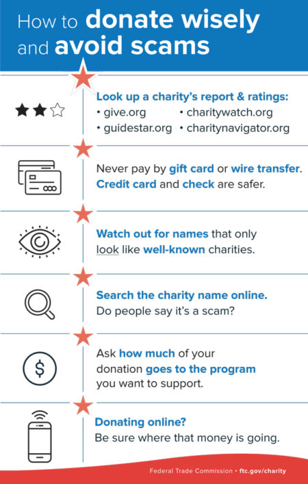

Telecommunication fraud continues to grow exponentially, with reported losses in 2021 of $383 million in [Canada](https://www.sipstack.com/resources/blog/the-state-of-spam-calling-in-canada)[^1] and a whopping $30 billion in the [United States](https://www.sipstack.com/resources/blog/the-state-of-spam-calling-in-the-US)[^2]. There are several different types of spam calling and texting scams that have contributed to these losses. A particularly unsettling one is known as the Veteran Charity Phone Scam. 

## What are Veteran Charity Phone Scams?

Simply put, these refer to scams where scammers pose as charities for war veterans and solicit donations via phone calls under this false pretence. Taking advantage of both the gratitude and generosity that people feel towards war veterans results in a very lucrative, and especially unethical, scam. Most of the donations are financial, but some have also included cars, boats, and other gifts. In most cases, these fake veterans charities will keep most, if not all, of the contributions for themselves.

The FTC recently <a href= 'https://www.ftc.gov/news-events/news/press-releases/2018/07/ftc-states-combat-fraudulent-charities-falsely-claim-help-veterans-servicemembers' target="_blank"> announced a total of 100 enforcement actions against these types of fake veteran charities and released a PSA video warning about these scams.

## How to Protect Yourself Against Veteran Charity Phone Scams

1. Use [Whois by SIPSTACK](https://whois.sipstack.com/) to check information of the phone number calling you.

2. Take these proactive steps recommended by the FTC: 

3. Research any charity before donating. ‍A simple search for the charity, including articles and reviews, will often tell you all you need to know. If you can’t find a company website or information that explicitly states they’re a 501(c)(3) organization, it could be a for-profit scam posing as a charity. 

Here are some websites we recommended looking up for ratings and reports:

- <a href= 'https://www.give.org' target="_blank"> https://www.give.org
- <a href= 'https://www.charitywatch.org' target="_blank"> https://www.charitywatch.org
- <a href= 'https://www.guidestar.org' target="_blank"> https://www.guidestar.org
- <a href= 'https://www.charitynavigator.org' target="_blank"> https://www.charitynavigator.org

4. Never pay by gift card or wire transfer. ‍Legitimate charities will never request these kinds of payment methods and will also always be able to provide receipts for tax deductions.

5. ‍Beware of so-called “charity” names that resemble well known charities, as imitating legitimate charities is a common scamming practice. The following is a list of fraudulent charities to avoid who have recently settled suits with the FTC:

- Help the Vets
- American Disabled Veterans Foundation
- Military Families of America
- Veterans Emergency Blood Bank
- Vets Fighting Breast Cancer
- Veterans Fighting Breast Cancer
- Veterans of America
- Vehicles for Veterans LLC
- Saving Our Soldiers
- Donate Your Car
- Donate That Car LLC
- Act of Valor
- Medal of Honor

6. Ask specific questions, of which real charities will have answers to but scammers will often not. The FTC recommends these questions in particular:
- What’s the charity’s website, address, and mission?
- How much of your donation will go directly to services that help veterans, rather than fundraising?
- How much of your donation will be used for the specific programs you want to support?
- If supporting veterans in your own community is important to you, ask how the charity spends money in your area.

7. Look for specific red flags/warning signs. Here is a checklist that the FTC recommends paying attention to:
- Refusing to provide detailed information about its identity, mission, costs, and how the donation will be used.
- Won’t provide proof that a contribution is tax deductible.
- Thanks you for a previous pledge you don’t remember making.
- Uses high-pressure tactics like trying to get you to donate immediately, without giving you time to think about it and do your research.
- Asks for donations in cash or gift cards, or asks you to wire money.
- Offers to send a courier or overnight delivery service to collect the donation immediately.
- Guarantees sweepstakes winnings in exchange for a contribution. Legally, you never have to give a donation to be eligible to win a sweepstakes.

8. If you suspect you’ve been a victim of a veteran charity phone scam, report it to the FTC ASAP. The more information you can provide them with, the better they will be able to protect you and other potential victims in the future. Relevant details include the fundraiser’s name, phone number, website, address, and any other information they gave you.

## How SIPSTACK Fights Fraud

Using the latest technology and machine learning, SIPSTACK's systems authenticate all activity in real time against variables that affect your security. When a carrier implements SIPSTACK's [Smart CNAM](https://www.sipstack.com/products/smart-cnam), they are able to customize a threshold for calls to pass through, based on their specific needs. At SIPSTACK we take an active role in ensuring we are building a secure and connected tomorrow. [Contact us](https://www.sipstack.com/contact/us) today to learn how you can protect yourself from spam.

### References
[^1]: https://www.antifraudcentre-centreantifraude.ca/index-eng.htm
[^2]: https://www.rcmp-grc.gc.ca/en/news/2022/fraud-prevention-month-raises-awareness-a-historic-year-reported-losses

