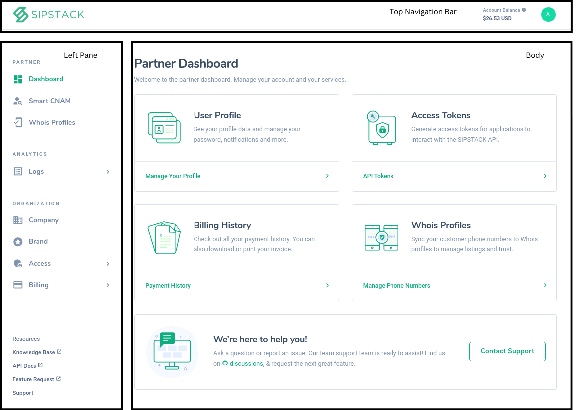
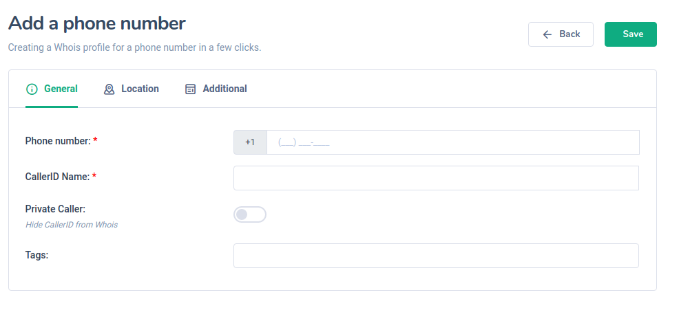

# Overview 

The SIPSTACK partner portal is the central hub that gives you access to all the products in the SIPSTACK ecosystem. It also allows you to edit/add information relating to your company, brand and payment settings, review invoices, logs and transaction history and also generate api tokens to integrate our products within your systems. 

# Design 

The SIPSTCK partner portal is divided into three distinct areas: 

**Left pane**

Provides access to all of the features, products, account management tools and resources.

 **Top navigation bar** 
 
Provides the account balance which is the total available funds in your account and the profile icon which is a shortcut to user profile information, dark mode and logging out of your account. 
 
 **Body**

 This is where the input and output of all our products and settings are displayed. 

 Different aspects of the Partner Dashboard.

# Getting Started 
Creating an account gives you access to our ever-evolving suite of products. To create a SIPSTACK partner account, select Get Started, icon on the top right corner of the home page. Simply follow the prompts and complete the form. Don’t forget to select the box to indicate that you agree to the Terms of Service. You will receive an email confirmation to finish setting up your account. 
 
Once you receive the email, click on verify email to finish setting up your account. This will open a web wizard and take you through the steps to activate your account.  

# Partner Section

## Dashboard 

The dashboard page provides shortcuts to the most frequented pages such as the User Profile and Billing History. The header of dashboard holds the SIPSTACK logo on the left hand side, a shortcut to the dashboard. 

## Smart CNAM 

For documentation regarding our Smart CNAM product please [click here.](https://www.sipstack.com/resources/docs/smart-cnam)

## Whois Profiles  

Whois profiles allows you to register and add information pertaining to phone numbers you own. This allows you to enhance the score rating of those phone numbers, as well as utilize the Source/Risk lookup function. 

### How do I register numbers? 

To register a number under a carrier, select Whois Profiles on the left pane. Select the green plus button and fill all required fields under the three tabs: general, location and additional. Transparency helps your own Source/Risk score and the larger goal of creating  safer telecommunications. To maintain privacy, simply toggle the private caller option to hide your information from others. Please note: failing to provide an accurate caller id information may impact your overall score as a carrier.

  
 
### Can I register a number I don’t own?

If a carrier attempts to register a number that they don’t own, we will be notified when the rightful owner signs up to register. Disciplinary actions will be sanctioned as seen fit, for example, lowering the score of the carrier for deceitful actions. This not impacts the carrier, but can also impact of it’s clients, hurting brand image. 

# Analytics 

## Logs 

This is where you will find logs relating to the SIPSTACK products that your organization is using. 

# Organization Section 

## Company

You can view and update your company’s information by selecting Company in the left pane under the Organization section. Ensuring that your information is up to date and accurate helps the accuracy of your risk score, as well as making telecommunications more secure. 

## Brand 

You can view your brand information, this is the domain that you have registered with SIPSTACK. 

## Access

Here you are able to view the users that are part of your organization, generate API tokens and update your profile information.  

### Users

View the users that are part of your organization.

### API Tokens

Generate API tokens for each application that needs access to our API. 

### My Profile

You can update or add profile information and manage user settings by selecting My Profile in the left pane found under Access, or by clicking on your profile icon in the header and selecting My Profile. Under the General tab you can edit your name and email, the Advanced tab gives access to passwords changes and updates, and finally the Notification tab manages notification preferences.  

## Billing

You can view your invoices, payments, detailed transaction history, and payment methods under Billing.  At the header of these results there are two mechanisms that can refine and reorder your resulting data. The first button, three lines, filters by: name, card number, status of payment and even date. The second button, a gear, alters the quantity of results shown to 10, 20 and 50. It also sorts data by date created or last updated which can be ordered by descending or ascending order. 

### Overview 
This is where you will find your account details and make payments/add funds to your account. This page also provides a summary of the last payment made, as well as a shortcut to view transaction history. 
  
####  Adding funds to your account 

To add funds to your account instantly, select Overview in the left pane under Billing. Simply select the desired card, input the amount and click Pay Now.  You can add and manage your credit cards in Payment Methods, found under Billing in the left pane. Please note that there is a small convenience fee of 2.95% that is applied. For large accounts contact our billing team to discuss alternate payment options.   
 
###  View Invoices 
A summary of all invoices is provided on the main page, which you can select to view the pertaining invoice. Invoices are generated on the 1st  of the month, with a breakdown of charges and applicable taxes for expensing and taxes. 

### View Payments 
Anytime you add funds to your account through the website, a record of it is stored here, 
This way, you can keep track of your payments. If you find that you are adding funds to your account often, contact our billing team to discuss a seamless payment plan. 
  
###  View Transactions 
A detailed transaction history is provided including all payments, credits and invoices.  The header sorts the information by type of payment, amount paid, and the new balance owing. 

### Payment Methods 
 
You can add and manage your credit cards in Payment Methods, found under Billing in the left pane. To add a payment method use the green plus button to add any major credit card.

### Pricing 
 
Pricing for our products can be found in Pricing under Billing in the left pane, Please note that all pricing is in USD and does not include applicable taxes.

