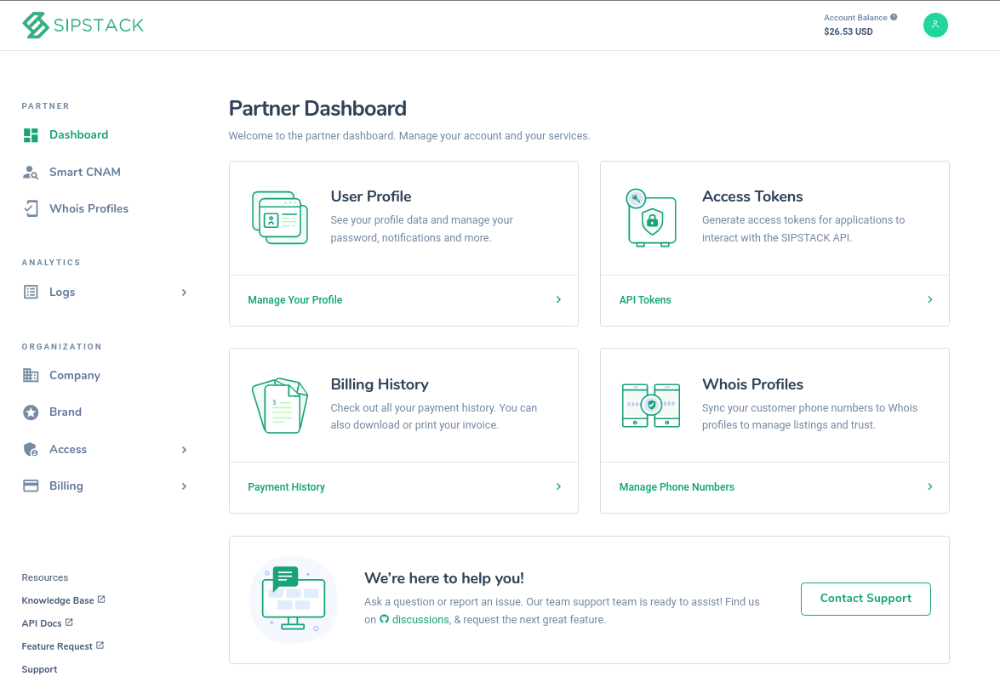

 An overview of the Partner Dashboard

#Creating a Partner account
Creating an account gives you access to our ever-evolving suite of products. For a limited time, when you sign up, SIPSTACK gifts you a $25USD credit! To create a partner account, select Get Started, icon on the top right corner of the home page. Simply follow the prompts and complete the form. Don’t forget to select the box to indicate that you agree to the Terms of Service. You will receive an email confirmation to finish setting up your account. 
 
Once you receive the email, click on verify email to finish setting up your account. This will open a web wizard and take you through the steps to activate your account.  

# Partner Dashboard 
The dashboard page provides shortcuts to the most frequented pages such as the User Profile and Billing History. The left pane is the taskbar, giving you access to all of the features, products, account management tools and resources. The header of dashboard holds the SIPSTACK logo on the left hand side, a shortcut to the dashboard. It also provides the Account Balance, the total available funds in your account and the profile icon, providing a shortcut to user profile information, and the dark mode of the website for comfortable viewing. 

# Add/Update Company Information 
You can view and update your company’s information by selecting Company in the left pane under the Organization section. Ensuring that your information is up to date and accurate helps your Source/Risk score, as well as making telecommunications more secure. 
 
# Add/Update My Profile Information  
You can update or add profile information and manage user settings by selecting My Profile in the left pane found under Access, or by clicking on your profile icon in the header and selecting My Profile. Under the General tab you can edit your name and email, the Advanced tab gives access to passwords changes and updates, and finally the Notification tab manages notification preferences.  

# Billing Overview 
This is where you will find your account details and make payments/add funds to your account. This page also provides a summary of the last payment made, as well as a shortcut to view transaction history. 

  
##  Adding funds to your account 

To add funds to your account instantly, select Overview in the left pane under Billing. Simply select the desired card, input the amount and click Pay Now.  You can add and manage your credit cards in Payment Methods, found under Billing in the left pane. Please note that there is a small convenience fee of 2.95% that is applied. For large accounts contact our billing team to discuss alternate payment options.   

## Invoices, Payments, Transactions and Payment Methods
You can view your invoices, payments, detailed transaction history, and payment methods under Billing.  At the header of these results there are two mechanisms that can refine and reorder your resulting data. The first button, three lines, filters by: name, card number, status of payment and even date. The second button, a gear, alters the quantity of results shown to 10, 20 and 50. It also sorts data by date created or last updated which can be ordered by descending or ascending order. 
 
###  View Invoices 
A summary of all invoices is provided on the main page, which you can select to view the pertaining invoice. Invoices are generated on the 1st  of the month, with a breakdown of charges and applicable taxes for expensing and taxes. 

### View Payments 
Anytime you add funds to your account through the website, a record of it is stored here, 
This way, you can keep track of your payments. If you find that you are adding funds to your account often, contact our billing team to discuss a seamless payment plan. 
  
###  View Transactions 
A detailed transaction history is provided including all payments, credits and invoices.  The header sorts the information by type of payment, amount paid, and the new balance owing. 

### How to add/edit payment methods 
 
You can add and manage your credit cards in Payment Methods, found under Billing in the left pane. To add a payment method use the green plus button to add any major credit card.

## Pricing 
 
Pricing for our products can be found in Pricing under Billing in the left pane, Please note that all pricing is in USD and does not include applicable taxes.
