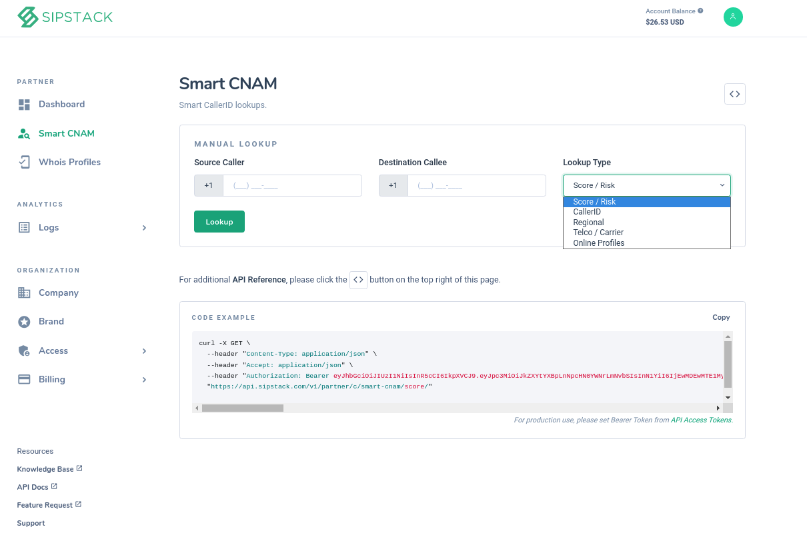

# Overview
Smart CNAM is the next generation lookup tool. Smart CNAM is immensely more comprehensive than the traditional [CNAM, Caller Name.](https://www.sipstack.com/resources/knowledge-base/general/what-is-cnam) Smart CNAM pairs with Whois Profiles to pull up a tremendous amount of relevant, up to date information, with just the click of a  button. 

 An overview of the Smart CNAM.

# Prerequisites
You will need a [SIPTACK Partner Account](https://www.sipstack.com/resources/docs/partner-portal).

Each lookup incurs an API charge, ensure you have sufficient [funds in your account](https://www.sipstack.com/resources/docs/partner-portal).

To use the Source/Risk lookup function, the destination callee number must be registered in your [Whois Profiles](https://www.sipstack.com/resources/docs/partner-portal)

# Smart CNAM
To access the Smart CNAM lookup system, select Smart CNAM on the left pane. 

## Running a Lookup
Input the Source Caller phone number to request information on, and if required, the Destination Callee as the phone number receiving the call. Select the desired lookup type 
from the drop-down menu and click lookup. The information based on the specific lookup type will be returned under the Results section. Please note standard API charges apply for each type of lookup. 

In order to run Source/ Risk lookup the Destination Callee number must be registered under Whois Profiles found on the left pane. 

## Lookup Type
Smart CNAM offers the following various Smart CallerID Lookups:  
•   Source/Risk: provides a score on a scale from 0-5.  
•   Caller ID: provides the name or location of the source caller.   
•   Regional: provides specific and accurate location of the source caller such as city, region and country.  
•   Telco/Carrier: provides information on the source caller’s carrier, company, provider and type of device.  
•   Online Profiles: provides the source caller’s public address as well as information of their online presence including any public websites, emails and all available social platform accounts.   

## Score/Risk scores calculations
SIPSTACK’s proprietary algorithm uses artificial intelligence and machine learning to uniquely weigh a number of factors to determine the score assigned to each call. The algorithm is ever-evolving to provide the best possible security to our customers. SIPSTACK allows individual carriers to interpret scores and determine safety thersholds independetly. 

## Cost
Prices are listed under Billing, Pricing in the left pane. Please note that each lookup incurs an API charge and the system will return a null result, if you don’t have sufficient funds in your account. 

## Adding funds to your account
Please see our article [Partner Portal.](https://www.sipstack.com/resources/docs/partner-portal) 

# FAQs 
You can find our frequently asked questions [here](https://www.sipstack.com/products/smart-cnam#faqs)

