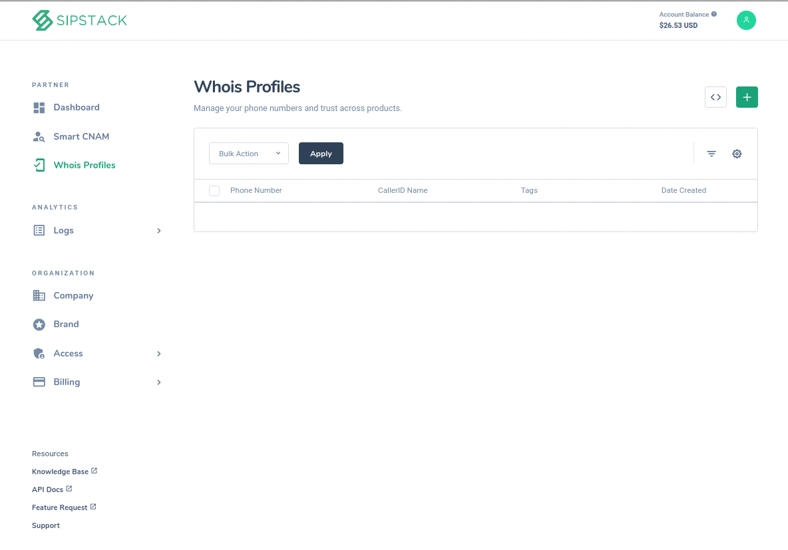

 An overview of the Whois Profiles

# Overview 
Whois profiles allows you to register and add information pertaining to phone numbers you own. This allows you to enhance the score rating of those phone numbers, as well as utilize the Source/Risk lookup function. 
# Prerequisites
You will need a [SIPTACK Partner Account](insert url to partner portal) 

## How do I register numbers? 
To register a number under a carrier, select Whois Profiles on the left pane. Select the green plus button and fill all required fields under the three tabs: general, location and additional. Transparency helps your own Source/Risk score and the larger goal of creating  safer telecommunications. To maintain privacy, simply toggle the private caller option to hide your information from others. Please note: failing to provide an accurate caller id information may impact your overall score as a carrier.
 
## Can I register a number I don’t own?
If a carrier attempts to register a number that they don’t own, we will be notified when the rightful owner signs up to register. Disciplinary actions will be sanctioned as seen fit, for example, lowering the score of the carrier for deceitful actions. This not impacts the carrier, but can also impact of it’s clients, hurting brand image. 

